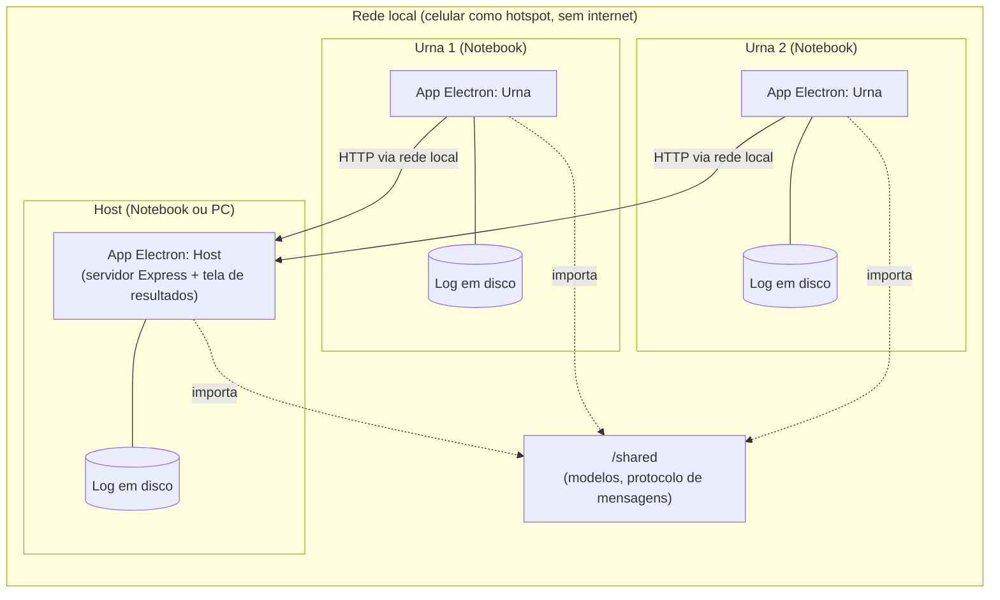

### Diagrama de arquitetura do sistema

```mermaid
flowchart 
    subgraph Rede["Rede local (celular como hotspot, sem internet)"]
        direction TB

        subgraph Urna2Maquina["Urna 2 (Notebook)"]
            direction TB
            Urna2App["App Electron: Urna"]
            Urna2App --- Urna2Log
            Urna2Log[("Log em disco")]
        end
        

        subgraph HostMaquina["Host (Notebook ou PC)"]
            direction TB
            HostApp["App Electron: Host<br/>(servidor Express + tela de resultados)"]
            HostLog[("Log em disco")]
            HostApp --- HostLog
        end

        subgraph Urna1Maquina["Urna 1 (Notebook)"]
            direction TB
            Urna1App["App Electron: Urna"]
            Urna1Log[("Log em disco")]
            Urna1App --- Urna1Log
        end

        Shared["/shared<br/>(modelos, protocolo de mensagens)"]

        Urna1App -.->|importa| Shared
        Urna2App -.->|importa| Shared
        HostApp -.->|importa| Shared

        Urna1App -->|HTTP via rede local| HostApp
        Urna2App -->|HTTP via rede local| HostApp
        end
```
