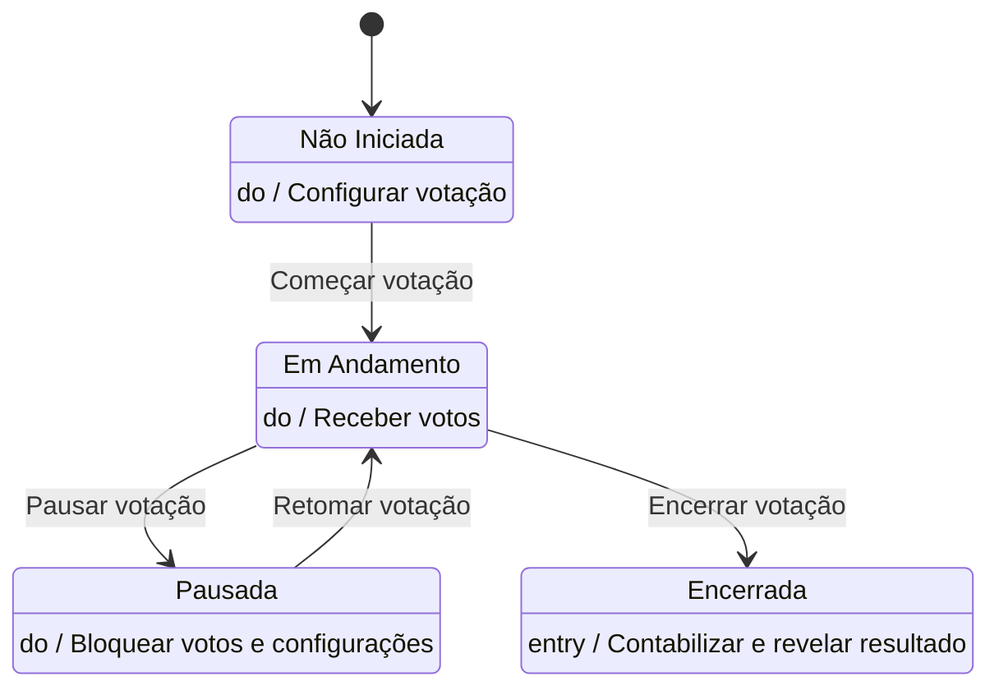

### Diagrama de estado do sistema no geral

```mermaid
stateDiagram-v2
    A: Não Iniciada
    B: Em Andamento
    C: Pausada
    D: Encerrada

    [*] --> A
    A --> B: Começar votação
    B --> C: Pausar votação
    C --> B: Retomar votação
    B --> D: Encerrar votação

    A: do / Configurar votação

    B: do / Receber votos

    C: do / Bloquear votos e configurações

    D: entry / Contabilizar e revelar resultado
```