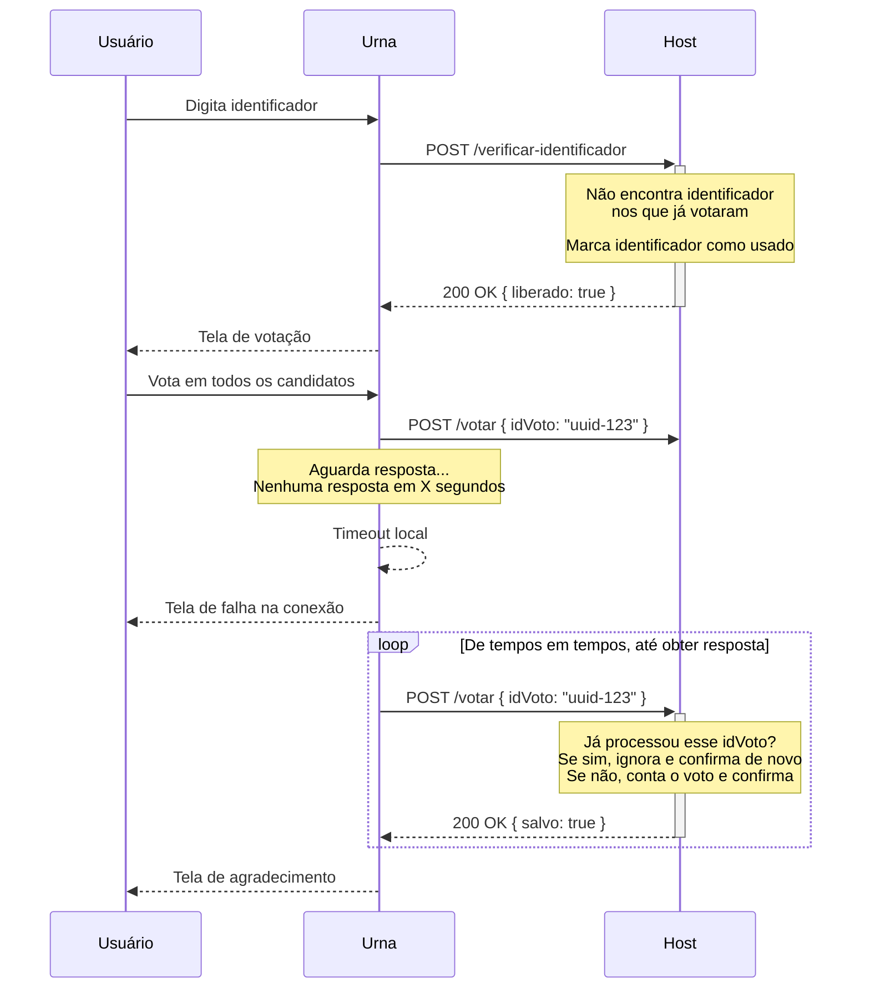

### Diagrama de sequência para um voto válido que foi interrompido por falha na rede

```mermaid
sequenceDiagram
    participant U as Usuário
    participant F as Urna
    participant H as Host

    U->>F: Digita identificador
    F->>+H: POST /verificar-identificador
    Note over H: Não encontra identificador<br/>nos que já votaram<br/><br/>Marca identificador como usado
    H-->>-F: 200 OK { liberado: true }
    F-->>U: Tela de votação


    U->>F: Vota em todos os candidatos
    F->>H: POST /votar { idVoto: "uuid-123" }
    Note over F: Aguarda resposta...<br/>Nenhuma resposta em X segundos
    F-->>F: Timeout local
    F-->>U: Tela de falha na conexão

    loop De tempos em tempos, até obter resposta
        F->>+H: POST /votar { idVoto: "uuid-123" }
        Note over H: Já processou esse idVoto?<br/>Se sim, ignora e confirma de novo<br/>Se não, conta o voto e confirma 
        H-->>-F: 200 OK { salvo: true }
    end
    F-->>U: Tela de agradecimento
```