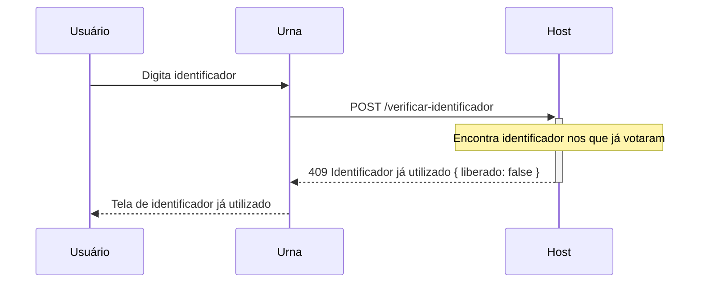

### Diagrama de sequência para um voto inválido

```mermaid
sequenceDiagram
    participant U as Usuário
    participant F as Urna
    participant H as Host

    U->>F: Digita identificador
    F->>+H: POST /verificar-identificador
    Note over H: Encontra identificador nos que já votaram
    H-->>-F: 409 Identificador já utilizado { liberado: false }
    F-->>U: Tela de identificador já utilizado
```