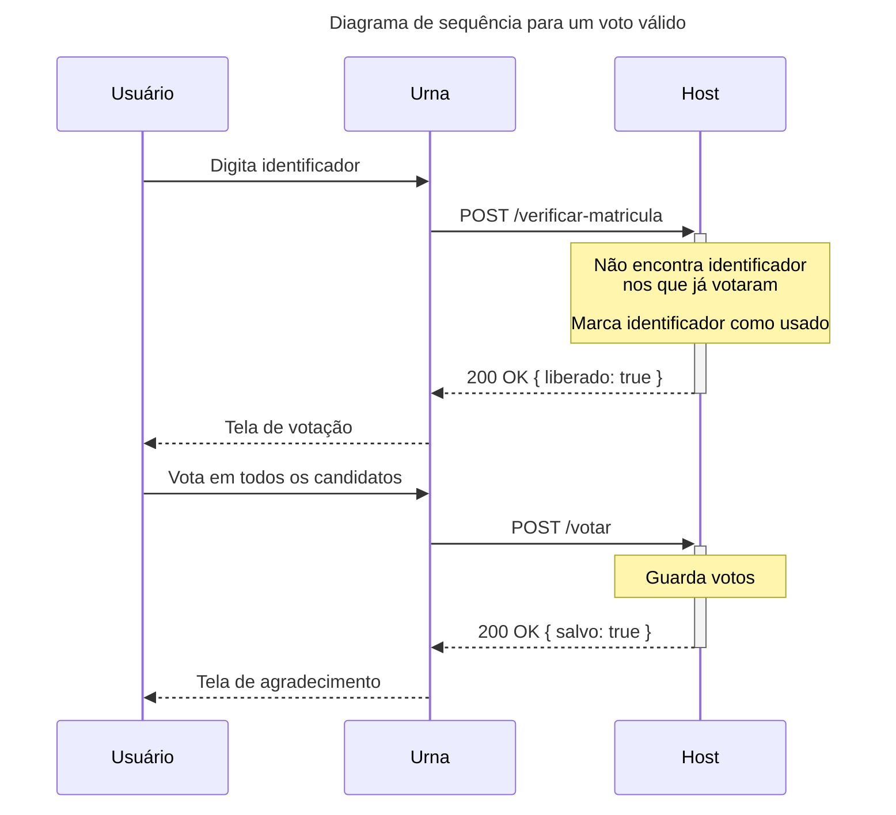

```mermaid
sequenceDiagram
    title Diagrama de sequência para um voto válido

    participant U as Usuário
    participant F as Urna
    participant H as Host

    U->>F: Digita identificador
    F->>+H: POST /verificar-matricula
    Note over H: Não encontra identificador<br/>nos que já votaram<br/><br/>Marca identificador como usado
    H-->>-F: 200 OK { liberado: true }
    F-->>U: Tela de votação


    U->>F: Vota em todos os candidatos
    F->>+H: POST /votar
    Note over H: Guarda votos
    H-->>-F: 200 OK { salvo: true }
    F-->>U: Tela de agradecimento
```